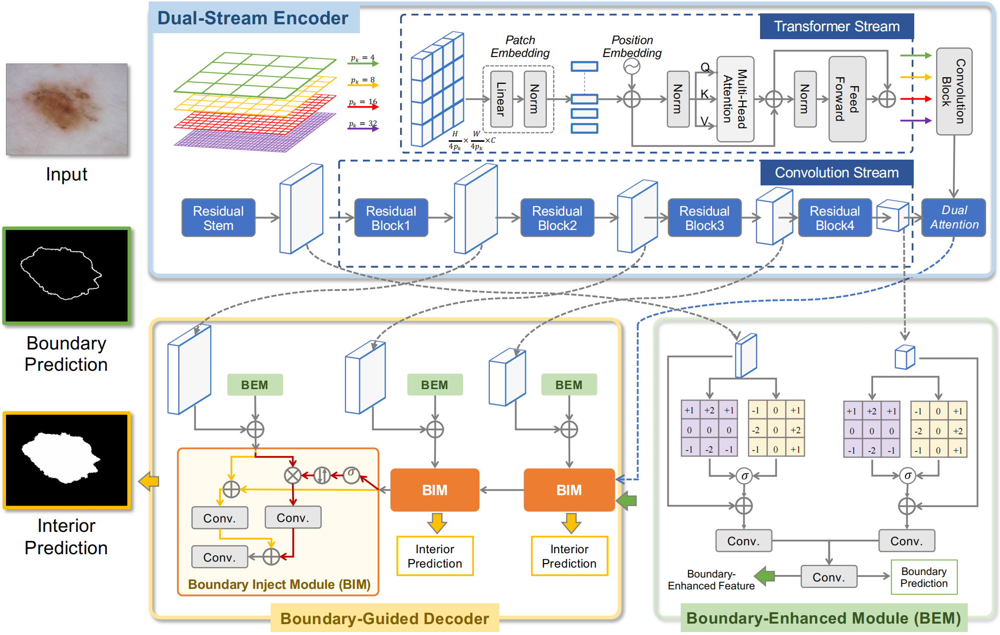

# CTO
This is the official code for "Rethinking	Boundary	
Detection	in	Deep	Learning
Models	for	Medical	Image	
Segmentation"

## Method


## Usage
The code is largely built using [MedISeg](https://github.com/hust-linyi/MedISeg) framework.

### Using the code
Please clone the following repositories:
```
git clone https://github.com/xiaofang007/CTO
cd CTO  
git clone https://github.com/hust-linyi/MedISeg
```
### Requirement
```
pip install -r MedISeg/requirements.txt
```

### Data preparation
ISIC-2018: please follow the data preparation procedure in [MedISeg](https://github.com/hust-linyi/MedISeg) framework.

### Training & Evaluation
We provide the shell scripts for training and evaluation.  
ISIC-2018:  
Run the following command for training
```
sh config/isic_baseline.sh
```  
Run the following command for testing
```
sh config/isic_test_baseline.sh
```


## Citation
Please cite the paper if you use the code.
```
```